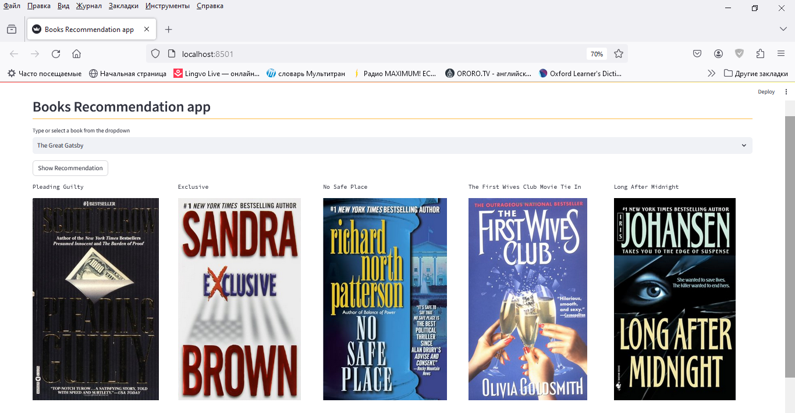

# Project: Book Recommender System Using Machine Learning | Collaborative Filtering Based


## About this project:

This is a streamlit web application that can recommend various kinds of similar books based on
a user interest.


## Preview:
Here's a preview of what the app looks like:




## Dataset
You can download the datasets from here:

* [Dataset link](https://www.kaggle.com/ra4u12/bookrecommendation)

After that you need to place the datasets (three files) in the data/ directory

## Training the model
### STEP 1:

Clone the repository

```bash
git clone https://github.com/Ilyafromural/book_recsys.git
```


### STEP 2
Create a virtual environment after opening the repository

First run this command to create a virtual environment:
```bash
python3 -m venv venv 
```
Then activate the virtual environment:
```bash
source venv/bin/activate
```


### STEP 3
Install all the dependencies
```bash
pip install -r requirements.txt
```


### STEP 4
Run this file to train the model, transform data and save all the necessary data in files
```bash
python3 pipeline.py 
```

If you are a Windows user you may need to run this command:
```bash
python pipeline.py 
```

## Running the app
To launch the app itself run this command:
```bash
streamlit run app.py
```
